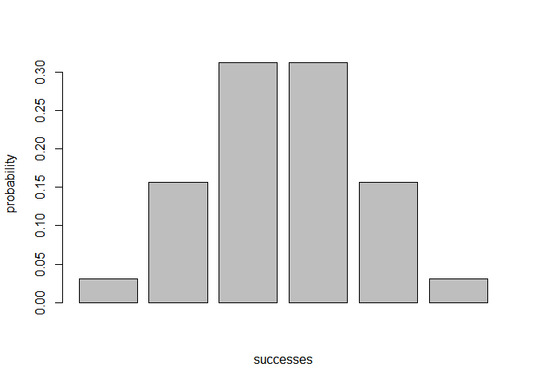
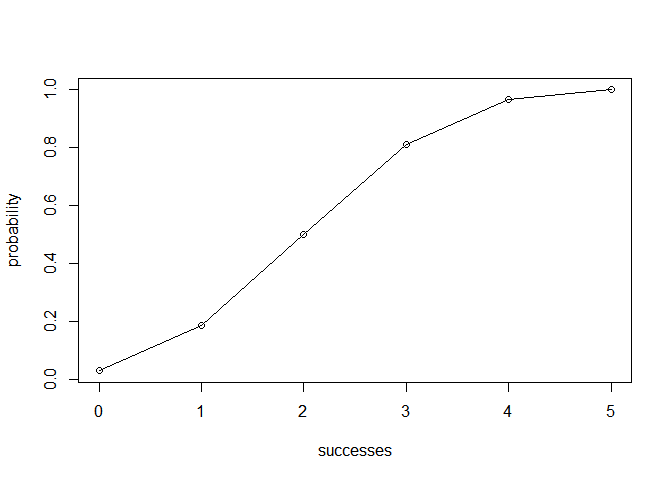

<!-- README.md is generated from README.Rmd. Please edit that file -->
Overview
--------

`"binomial"` is a minimal [R](http://www.r-project.org/) package that implement functions for calculating probabilities of a Binomial random variable, and related calculations such as the probability distribution, the expected value, variance, etc.

-   `bin_choose()` calculates the number of combinations of successes in multiple trials.
-   `bin_probability()` calculates the probability of successes in multiple trials.
-   `bin_distribution()` shows a data frame (with two classes: `"bindis"` and `"data.frame"`) with the probability distribution.
-   `bin_cumulative()` shows a data frame (with two classes: `"bincum"` and `"data.frame"`) with the binomial cumulative distribution.
-   `bin_variable()` shows a list of class `"binvar"` with named elements `trials` and `prob`.
-   `bin_mean()` calculates the mean of a binomial distribution.
-   `bin_variance()` calculates the variance of a binomial distribution.
-   `bin_mode()` calculates the mode of a binomial distribution.
-   `bin_skewness()` calculates the skewness of a binomial distribution.
-   `bin_kurtosis()` calculates the kurtosis of a binomial distribution.
-   `plot()` method for a `"bindis"` object to display the probability histogram of a binomial distribution.
-   `plot()` method for a `"bincum"` object to graph the binomial cumulative distribution.
-   `summary()` method for a `"binvar"` object.

Motivation
----------

This package has been developed to illustrate some of the concepts behind the creation of an R package.

Installation
------------

Install the development version from GitHub via the package `"devtools"`:

``` r
# development version from GitHub:
#install.packages("devtools") 
# install "binomial" (without vignettes)
devtools::install_github("stat133-sp19/hw-stat133-feng1128/binomial")
# install "binomial" (with vignettes)
devtools::install_github("stat133-sp19/hw-stat133-feng1128/binomial", build_vignettes = TRUE)
```

Usage
-----

``` r
library(binomial)

# the number of combinations in which 2 successes can occur in 5 trials
choose_successes <- bin_choose(n = 5,k = 2)
choose_successes
#> [1] 10

# the probability of getting 2 successes in 5 trials
# assume the probability of success in each trial is 0.5
p <- bin_probability(success = 2, trials = 5, prob = 0.5)
p
#> [1] 0.3125

# the probability distribution of 5 trials
# assume the probability of success in each trial is 0.5
dis1 <- bin_distribution(trials =5, prob = 0.5)
dis1
#>   success probability
#> 1       0     0.03125
#> 2       1     0.15625
#> 3       2     0.31250
#> 4       3     0.31250
#> 5       4     0.15625
#> 6       5     0.03125
# plot the histogram of the distribution
plot(dis1)
```



``` r

# the binomial cumulative distribution of 5 trials
# assume the probability of success in each trial is 0.5
dis2 <- bin_cumulative(trials =5, prob = 0.5)
dis2
#>   success probability cumulative
#> 1       0     0.03125    0.03125
#> 2       1     0.15625    0.18750
#> 3       2     0.31250    0.50000
#> 4       3     0.31250    0.81250
#> 5       4     0.15625    0.96875
#> 6       5     0.03125    1.00000
# plot the cumulative distribution
plot(dis2)
```



``` r

# the list of the binomial probability of 5 trials
# assume the probability of success in each trial is 0.5
bin1 <- bin_variable(trials =5, prob = 0.5)
bin1
#> "Binomial variable"
#> 
#> Parameters 
#> - number of trials: 5 
#> - prob of success: 0.5
# summary
summary(bin1)
#> "Summary Binomial"
#> 
#> Parameters 
#> - number of trials: 5 
#> - prob of success: 0.5 
#> 
#> Measures 
#> - mean: 2.5 
#> - variance: 1.25 
#> - mode: 3 - mode: 2 
#> - skewness: 0 
#> - kurtosis: -0.4

# the mean of 5 trials with the probability of success = 0.5 in each trial
me <- bin_mean(5, 0.5)
me
#> [1] 2.5

# the variance of 5 trials with the probability of success = 0.5 in each trial
v <- bin_variance(5, 0.5)
v
#> [1] 1.25

# the mode of 5 trials with the probability of success = 0.5 in each trial
mo <- bin_mode(5, 0.5)
mo
#> [1] 3 2

# the skewness of 5 trials with the probability of success = 0.5 in each trial
s <- bin_skewness(5, 0.5)
s
#> [1] 0

# the kurtosis of 5 trials with the probability of success = 0.5 in each trial
k <- bin_kurtosis(5, 0.5)
k
#> [1] -0.4
```
