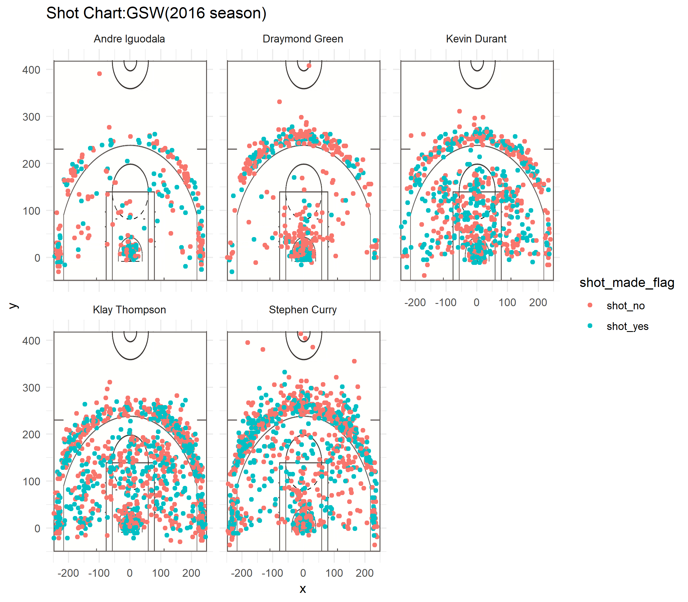

```{r}
library(jpeg)
library(grid)
library(dplyr)
library(ggplot2)
shots_data1<-read.csv("../data/shots-data.csv",stringsAsFactors = FALSE)
```

```{r}
#2PT Effective Shooting% by Player
arrange(summarise(group_by(shots_data1,name),total=sum(shot_type=="2PT Field Goal"),made=sum((shot_type=="2PT Field Goal")&(shot_made_flag=="shot_yes")),perc_made=made/total),desc(perc_made))
```

```{r}
#3PT Effective Shooting% by Player
arrange(summarise(group_by(shots_data1,name),total=sum(shot_type=="3PT Field Goal"),made=sum((shot_type=="3PT Field Goal")&(shot_made_flag=="shot_yes")),perc_made=made/total),desc(perc_made))
```

```{r}
#Effective Shooting% by Player
arrange(summarise(group_by(shots_data1,name),total=sum(shot_type=="2PT Field Goal"|shot_type=="3PT Field Goal"),made=sum(shot_made_flag=="shot_yes"),perc_made=made/total),desc(perc_made))
```

```{r out.width='80%',echo=FALSE,fig.align='center'}

```
